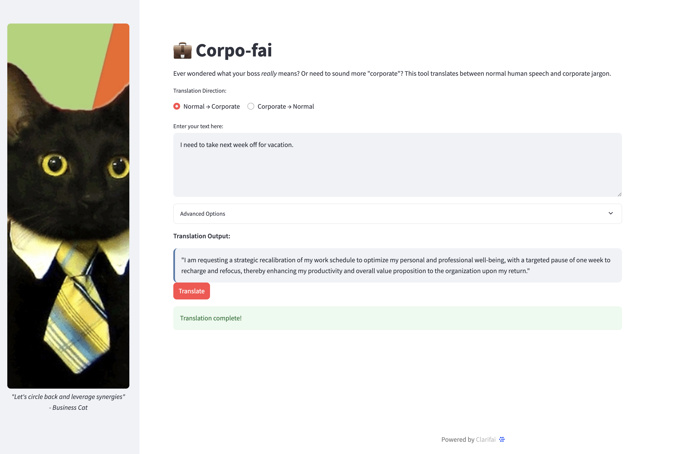

# Corporate Speech Translator 🐱💼



A silly Streamlit app that translates between normal human speech and corporate jargon using a Clarifai-hosted LLM.

## Features

- **Two-way translation**:
  - Normal English → Corporate Jargon
  - Corporate Jargon → Normal English
- **Real-time streaming** of responses as they're generated
- **Adjustable creativity** to control jargon intensity
- **Business Cat** - your corporate mascot overseeing translations

## How It Works

This app demonstrates:
- Using Clarifai's API to access hosted LLMs (Meta Llama 3.2 in this case)
- Streamlit for building interactive web apps
- Real-time text streaming for better user experience
- Creative prompt engineering for humorous translations

## Installation

1. Clone this repository
   ```
   git clone https://github.com/minhagin-clarifai/module-corporate-translator.git
   cd corporate-speech-translator
   ```

2. Install dependencies
   ```
   pip install -r requirements.txt
   ```

3. Set up your Clarifai PAT in the script (or as environment variable)

4. Run the app
   ```
   streamlit run app.py
   ```

## Requirements

- Python 3.8+
- Streamlit
- Clarifai Python client
- Pillow (for image processing)

## About the Tech

This toy project showcases:
- **Clarifai's platform** for easy access to powerful LLMs
- **Streamlit** for rapid web app development
- **Prompt engineering** to create specific translation behaviors
- **Real-time streaming** for engaging user experience

## Try It Yourself!

Want to explore more AI models like this?

[Sign up with Clarifai](https://clarifai.com/signup) to access hundreds of state-of-the-art AI models for your projects!

---

*Disclaimer: This is a humorous project. Any resemblance to actual corporate communications is purely coincidental (but probably accurate).*